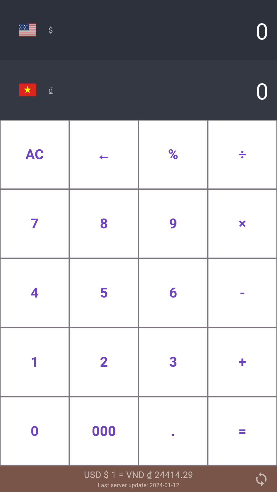
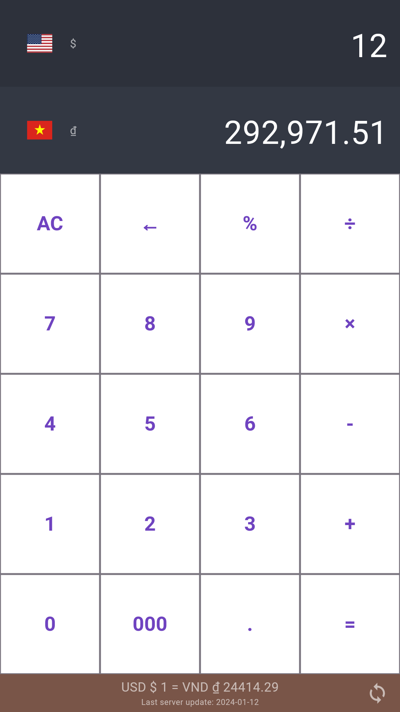
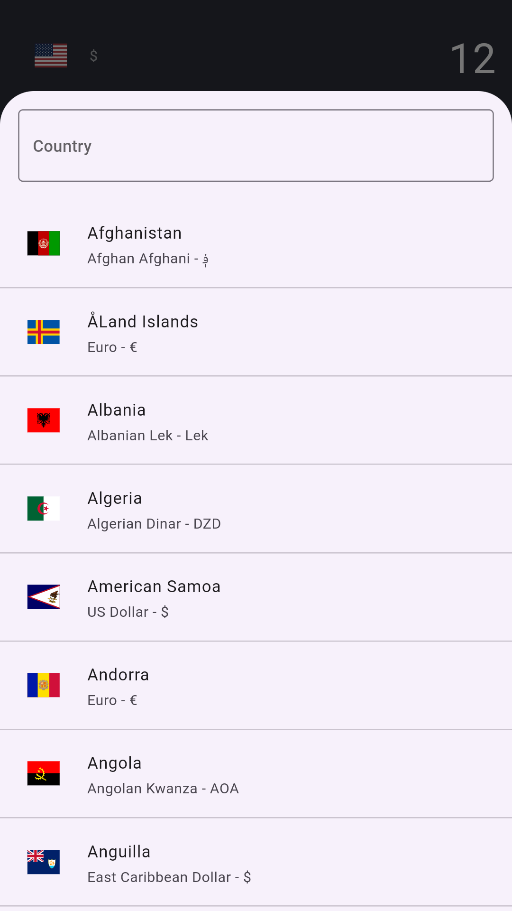

# Currency converter

An app can convert curreny between currencies. It also can synchronize newest exchange rates and save local to convert offline

| Env             | Version |
| --------------- | ------- |
| Flutter | 3.16.5 |

## Screenshots

 
 